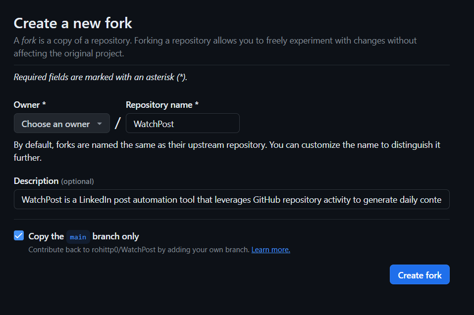
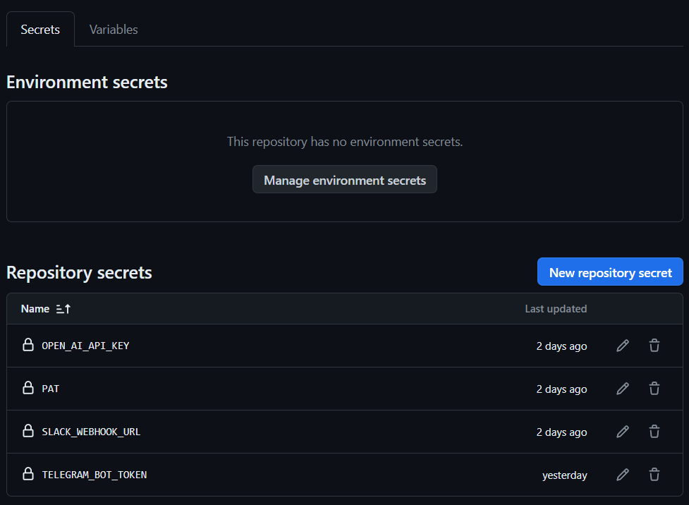
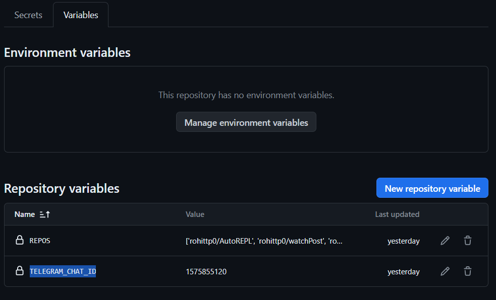

# WatchPost

**WatchPost** is an automated LinkedIn post creation tool that creates LinkedIn posts for you based on your activity on
GitHub. It goes through your repos checks what happened in the last 24 hours and based on that writes you a LinkedIn
post talking about what you have been up to since the last post. And the cool thing about WatchPost is that it **runs
completely on GitHub Actions**, no 4th party hosting service is required!

## Features

### Available

- [x] Runs completely on GitHub Actions
- [x] Posts are generated in LinkedIn post format so that it can be directly copy pasted.
- [x] Supports any OpenAI model
- [x] Can be configured to generate posts in any tone or style you like
- [x] Notifies you when a new post is available via Slack or Telegram
- [x] Keeps continuity between previous posts
- [x] Posts can be manually edited and this edit will be considered when generating the next post

### Planned

- [ ] A Web UI to configure WatchPost
- [ ] Support models from Ollama
- [ ] LinkedIn API integration to directly post to LinkedIn

## Getting Started

Getting WatchPost running for you is extremely easy. Just fork this repo and set some environment variables, that's it!

### 1. Fork

You need to fork this repo to your profile or an organization you have write access to. Click on the fork button above
and remember to check the fork master branch-only option.


### 2. Set Action Secrets

You can set up GitHub Actions secret by following
this [guide](https://docs.github.com/en/actions/security-guides/using-secrets-in-github-actions) from GitHub.

The secrets to set up are:

| Name               | Required | Description                                                                                                                                                                   |
|--------------------|----------|-------------------------------------------------------------------------------------------------------------------------------------------------------------------------------|
| OPEN_AI_API_KEY    | Yes      | You can get the API key from [OpenAI](https://platform.openai.com/api-keys) website. The key should have Write access to `/v1/chat/completions`                               |
| PAT                | Yes      | This is your personal access token with a `repo` scope. Get it [here](https://github.com/settings/tokens/new)                                                                 |
| SLACK_WEBHOOK_URL  | No       | You need to create a Slack app with webhook enabled, if you want to get notified in Slack. Follow this [tutorial](https://api.slack.com/messaging/webhooks)                   |
| TELEGRAM_BOT_TOKEN | No       | You can create a Telegram Bot to get notified in Telegram when a new post is ready. Follow this [tutorial](https://www.siteguarding.com/en/how-to-get-telegram-bot-api-token) |

Once everything is set it should look something like this:


### 3. Set Action Variables

You can set up GitHub Actions Variables by following
this [guide](https://docs.github.com/en/actions/learn-github-actions/variables) from GitHub.

The variables to set are:

| Name             | Required | Description                                                                                                                                                                                                                                                                                                                     |
|------------------|----------|---------------------------------------------------------------------------------------------------------------------------------------------------------------------------------------------------------------------------------------------------------------------------------------------------------------------------------|
| REPOS            | Yes      | A list of repositories that you want WatchPost to monitor for changes. This should be formatted as an array. That is if you want to create LinkedIn posts based on your commits in the repos `rohittp0/gramup` and `tinkerhub/wit-conference`. The value of `REPOS` should be `['rohittp0/gramup', 'tinkerhub/wit-conference']` |
| TELEGRAM_CHAT_ID | No       | This is required only if you have `TELEGRAM_BOT_TOKEN` set. This is the chat to which you need to get notifications. Follow this StackOverflow [thread](https://stackoverflow.com/questions/31078710/how-to-obtain-telegram-chat-id-for-a-specific-user) to get it.                                                             |
| OPENAI_MODEL     | No       | By default WatchPost uses `gpt-3.5-turbo`, you can change this if required                                                                                                                                                                                                                                                      |

Once everything is set it should look something like this:


### That's it

That is all there is to do, now WatchPost will run every day at `00:00 PST` and create LinkedIn posts based on what you
have committed to the set repos in the last 24 hours. If you have set the SlackWebhook or Telegram Bot Token you will
get the post in Slack or Telegram respectively. You can also find your post ( and the whole post history ) by going to
the `/posts` folder in your fork of WatchPost under the branch corresponding to each repo.

## Sample Posts

These are some of the posts the WatchPost had generated for me,

```
🚀 Exciting news! 🌟 I've started a new project called WatchPost - a LinkedIn post automation tool that leverages GitHub repository activity for daily content updates. 📈🔍 

🔎 What I've accomplished so far:
- Created workflows for fetching git diffs and tracking repository changes.
- Set up Python environment for script execution.
- Configured templates for generating LinkedIn posts based on diffs.

Check out the project README at https://github.com/rohittp0/WatchPost to learn more!

#LinkedInAutomation #ProjectUpdate #GitHubActions #LinkedInEngagement
```

```
🚀 Update Alert! 🌟 Continuing with my WatchPost project journey! Daily content generation just got a major boost with new features added:

➡️ Updated the workflow to notify Slack when the webhook URL is present and added notifications for Telegram using the bot token. 
➡️ Added a new workflow to automatically update branches excluding 'main' and 'legacy'. 
➡️ Implemented functionality to clean up content by replacing Markdown links with plain text links. 
➡️ Created a new module for generating Telegram JSON for post sharing.

Excited to see how these new additions enhance the automation process! Check out the GitHub repo for more details:  [https://github.com/rohittp0/WatchPost](https://github.com/rohittp0/WatchPost)

#LinkedInAutomation #ProgressUpdate #GitHubActions #AIContentCreation
```

See more of these by looking at different branches of this repo

## How It Works

### GitHub Actions

There is a two-part GItHub action in WatchPost.

1. [Daily Diff](.github/workflows/daily-diff.yml)

   This Action is responsible for looping through all the repos in `REPOS` and finding out what changed since yesterday.
   It runs every day at `00:00`. For every repo in `REPOS`, it creates a new job that checks out the repo, finds the
   first commit that is at least 24 hours old, and creates a `git diff`. The action then checks out the branch
   corresponding to the repo in WatchPost ( creating it if it doesn't already exist ). The `git diff` is then stored
   in `diffs/{index}.txt`  where `index` is a counter.

2. [Python Script Runner](.github/workflows/run-python.yml)

   This action runs anytime there is a change in `diffs/**/*`. It runs a Python script that reads the changed diff file,
   gets the content, and generates the LinkedIn post based on it. The generated post is stored as `posts/{index}.md`. It
   also sends Slack and Telegram notifications for the posts if those are enabled.
